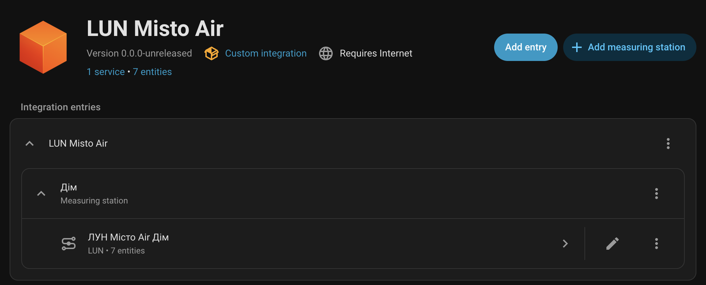
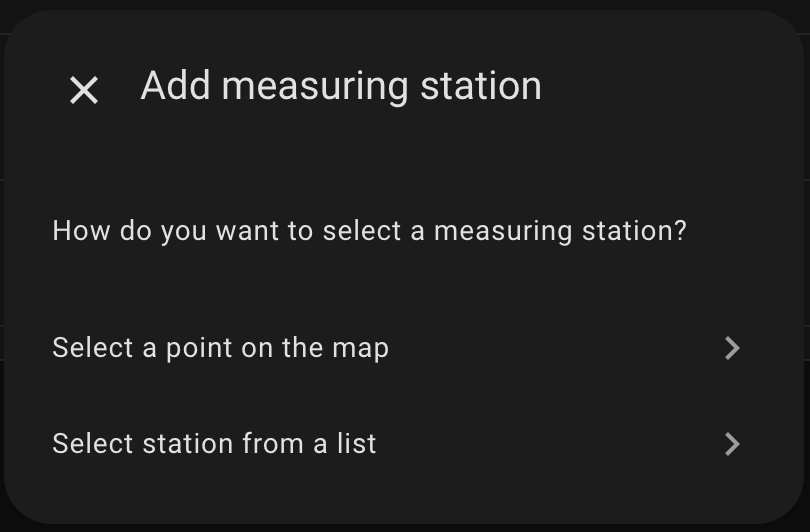
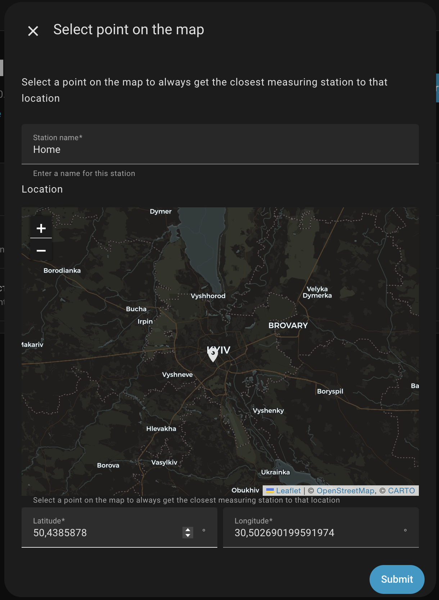
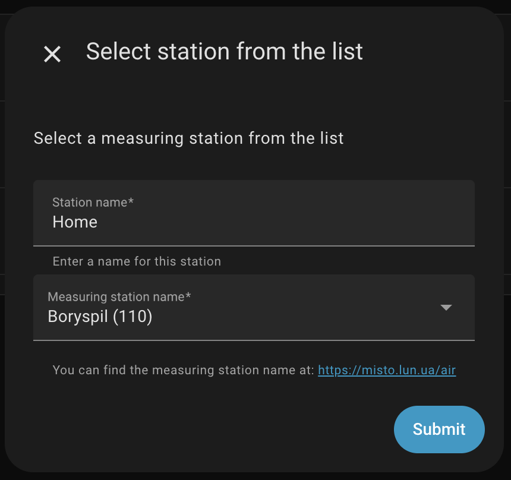
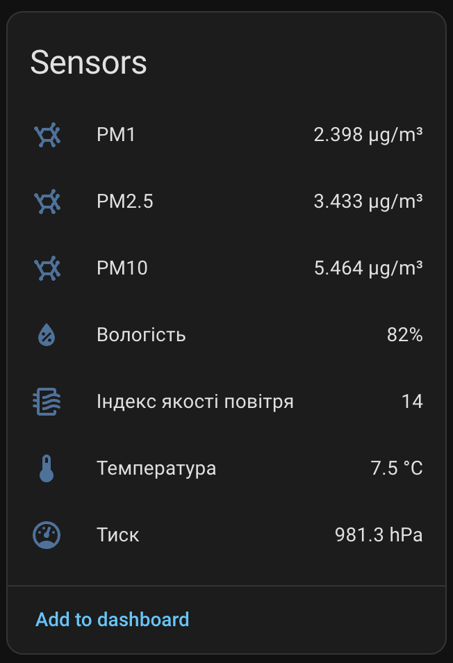

# 💨 HA LUN Misto Air

[![GitHub Release][gh-release-image]][gh-release-url]
[![GitHub Downloads][gh-downloads-image]][gh-downloads-url]
[![hacs][hacs-image]][hacs-url]
[![GitHub Sponsors][gh-sponsors-image]][gh-sponsors-url]
[![Buy Me A Coffee][buymeacoffee-image]][buymeacoffee-url]
[![Twitter][twitter-image]][twitter-url]

> [!NOTE]
> An integration for air quality monitoring by [LUN Misto][lun-misto].

> [!IMPORTANT]
> This is not affiliated with [LUN Misto][lun-misto] in any way. This integration is developed by an individual. Information may vary from their official website.

This integration for [Home Assistant][home-assistant] provides information about air quality metrics by [LUN Misto][lun-misto]: Air Quality Index (AQI), PM2.5, PM10, PM1, temperature, humidity, and pressure.

## Sponsorship

Your generosity will help me maintain and develop more projects like this one.

- 💖 [Sponsor on GitHub][gh-sponsors-url]
- ☕️ [Buy Me A Coffee][buymeacoffee-url]
- Bitcoin: `bc1q7lfx6de8jrqt8mcds974l6nrsguhd6u30c6sg8`
- Ethereum: `0x6aF39C917359897ae6969Ad682C14110afe1a0a1`

## Installation

The quickest way to install this integration is via [HACS][hacs-url] by clicking the button below:

[![Add to HACS via My Home Assistant][hacs-install-image]][hasc-install-url]

If it doesn't work, add this repository to HACS manually by using this URL:

1. Visit **HACS** → **Integrations** → **...** (in the top right) → **Custom repositories**
2. Click **Add**
3. Paste `https://github.com/denysdovhan/ha-lun-misto-air` into the **URL** field
4. Choose **Integration** as the **Category**
5. **LUN Misto Air** will appear in the list of available integrations. Install it normally.

## Usage

This integration is configurable via UI. On the **Devices and Services** page, click **Add Integration** and search for **LUN Misto Air**.

This integration supports subentries, so you can set up multiple stations for a single configuration.

You can select a measuring station by choosing a point on the map. The integration will automatically find the nearest station to the specified location on every update:

You can also find your station on the [LUN Misto website][lun-misto-air]. Select the station with the same name in the list:

The integration creates a sensor for each of the available metrics:

## Development

Want to contribute to the project?

First, thanks! Check the [contributing guideline](./CONTRIBUTING.md) for more information.

## License

MIT © [Denys Dovhan][denysdovhan]

<!-- Badges -->

[gh-release-url]: https://github.com/denysdovhan/ha-lun-misto-air/releases/latest
[gh-release-image]: https://img.shields.io/github/v/release/denysdovhan/ha-lun-misto-air?style=flat-square
[gh-downloads-url]: https://github.com/denysdovhan/ha-lun-misto-air/releases
[gh-downloads-image]: https://img.shields.io/github/downloads/denysdovhan/ha-lun-misto-air/total?style=flat-square
[hacs-url]: https://github.com/hacs/integration
[hacs-image]: https://img.shields.io/badge/hacs-default-orange.svg?style=flat-square
[gh-sponsors-url]: https://github.com/sponsors/denysdovhan
[gh-sponsors-image]: https://img.shields.io/github/sponsors/denysdovhan?style=flat-square
[buymeacoffee-url]: https://buymeacoffee.com/denysdovhan
[buymeacoffee-image]: https://img.shields.io/badge/support-buymeacoffee-222222.svg?style=flat-square
[twitter-url]: https://x.com/denysdovhan
[twitter-image]: https://img.shields.io/badge/follow-%40denysdovhan-000000.svg?style=flat-square

<!-- References -->

[lun-misto]: https://misto.lun.ua/
[lun-misto-air]: https://misto.lun.ua/air
[home-assistant]: https://www.home-assistant.io/
[denysdovhan]: https://github.com/denysdovhan
[hasc-install-url]: https://my.home-assistant.io/redirect/hacs_repository/?owner=denysdovhan&repository=ha-lun-misto-air&category=integration
[hacs-install-image]: https://my.home-assistant.io/badges/hacs_repository.svg
