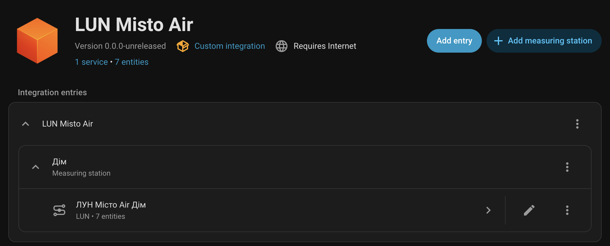
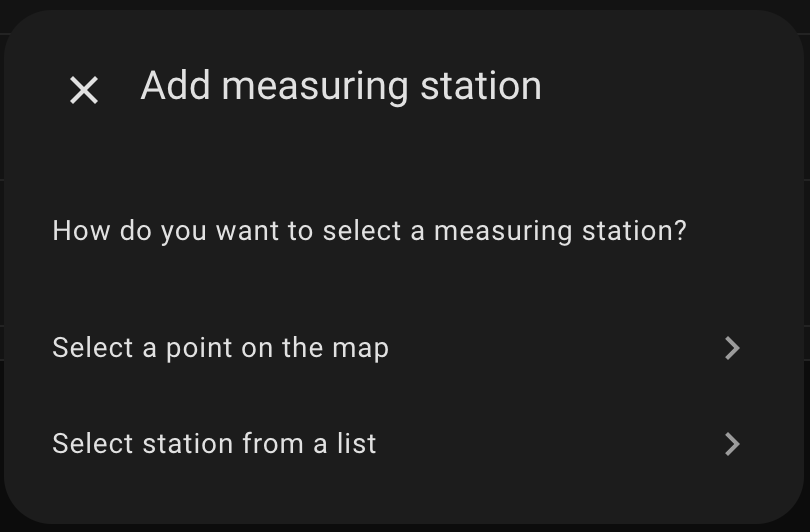
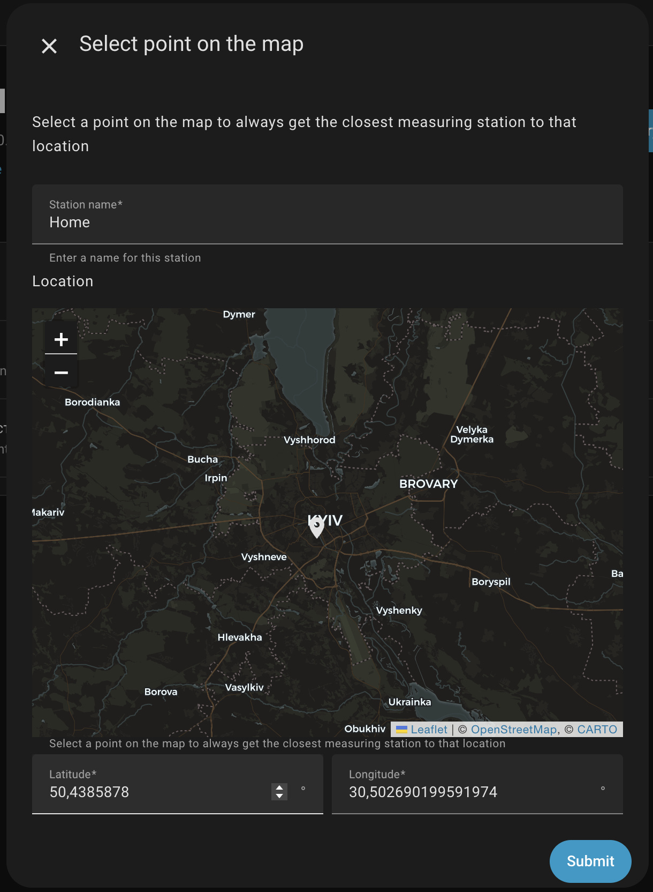
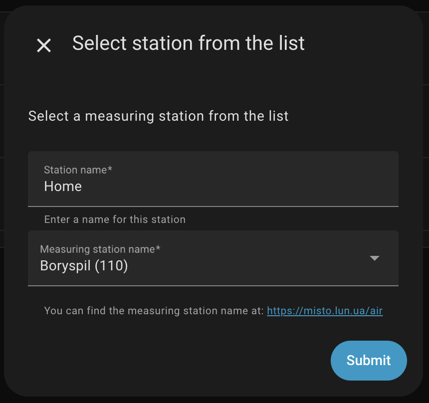
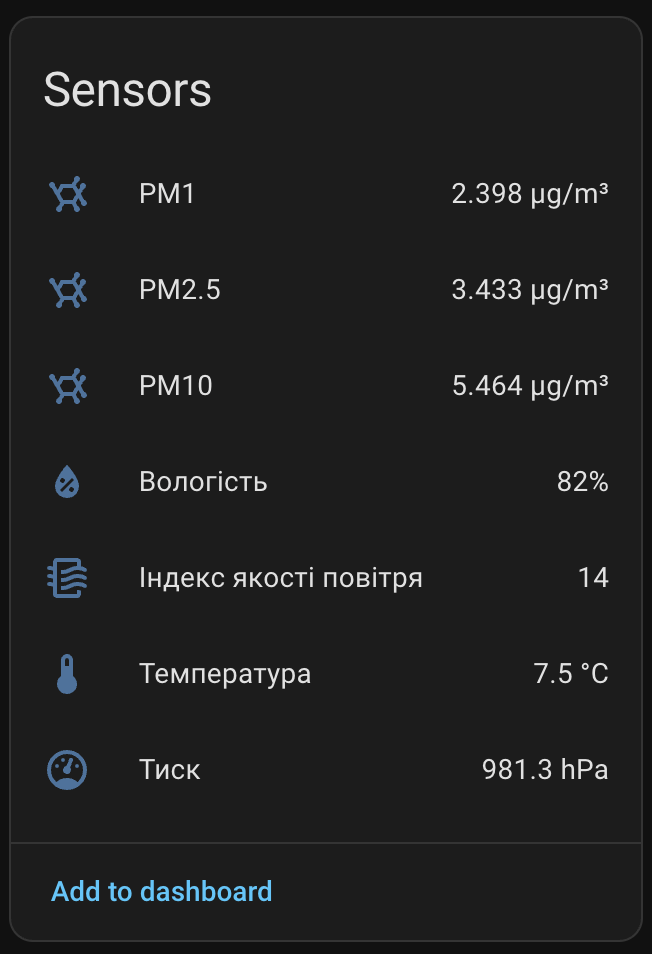

# 💨 ЛУН Місто Air для Home Assistant

[![GitHub Release][gh-release-image]][gh-release-url]
[![GitHub Downloads][gh-downloads-image]][gh-downloads-url]
[![hacs][hacs-image]][hacs-url]
[![GitHub Sponsors][gh-sponsors-image]][gh-sponsors-url]
[![Buy Me A Coffee][buymeacoffee-image]][buymeacoffee-url]
[![Twitter][twitter-image]][twitter-url]

[English](./readme.md) | [**Українською**](./readme.uk.md)

> [!NOTE]
> Інтеграція для моніторингу якості повітря за даними [ЛУН Місто][lun-misto].

> [!IMPORTANT]
> Цей проєкт не пов’язаний із [ЛУН Місто][lun-misto] і розробляється незалежно. Інформація може відрізнятися від даних на офіційному сайті.

Ця інтеграція для [Home Assistant][home-assistant] надає показники якості повітря від [ЛУН Місто][lun-misto]: індекс якості повітря (AQI), PM2.5, PM10, PM1, температуру, вологість і тиск.

## Спонсорство

Ваша підтримка допоможе мені розвивати й підтримувати більше таких проєктів.

- 💖 [Стати спонсором на GitHub][gh-sponsors-url]
- ☕️ [Підтримати на Buy Me A Coffee][buymeacoffee-url]
- Bitcoin: `bc1q7lfx6de8jrqt8mcds974l6nrsguhd6u30c6sg8`
- Ethereum: `0x6aF39C917359897ae6969Ad682C14110afe1a0a1`

## Встановлення

Найпростіше встановити інтеграцію через [HACS][hacs-url]:

[![Додати до HACS через My Home Assistant][hacs-install-image]][hacs-install-url]

  
Якщо кнопка не працює, додайте репозиторій вручну

1. Відкрийте **HACS** → **Інтеграції** → **...** (угорі праворуч) → **Користувацькі репозиторії**.
2. Натисніть **Додати**.
3. Вставте `https://github.com/denysdovhan/ha-lun-misto-air` у поле **URL**.
4. Виберіть **Інтеграція** як **Категорію**.
5. **ЛУН Місто Air** з’явиться у списку доступних інтеграцій. Встановіть її звичайним способом.

## Використання

Інтеграція налаштовується через інтерфейс. Натисніть кнопку нижче, щоб додати її:

[![Додати ЛУН Місто Air][install-image]][install-url]

  
Якщо кнопка не працює, додайте інтеграцію вручну

1. На сторінці **Пристрої та служби** натисніть **Додати інтеграцію**.
2. Знайдіть **ЛУН Місто Air**.
3. Виконайте кроки налаштування інтеграції.

Інтеграція підтримує підзаписи, тому в одному записі інтеграції можна налаштувати кілька станцій.

Вимірювальну станцію можна вибрати за точкою на карті. Під час кожного оновлення інтеграція автоматично знаходитиме найближчу до вказаного місця станцію:

Також можна знайти потрібну станцію на [сайті ЛУН Місто][lun-misto-air] і вибрати станцію з такою самою назвою у списку:

Інтеграція створює сенсор для кожного доступного показника:

## Розробка

Хочете долучитися до проєкту?

Дякую! Докладніше читайте в [настановах для учасників](./CONTRIBUTING.md).

## Інші інтеграції

- 💥 [Aerial Danger](https://github.com/denysdovhan/ha-aerial-danger) — виявляє повідомлення про повітряні загрози для вибраних регіонів і місцевостей України.
- ☁️ [Check Weather](https://github.com/denysdovhan/ha-check-weather) — створює бінарний сенсор на основі прогнозу погоди на кілька наступних годин.
- 🌦️ [Український гідрометеорологічний центр](https://github.com/denysdovhan/ha-ukr-hmc) — надає погодні, радіаційні й гідрологічні дані з meteo.gov.ua.
- ⚡️ [Yasno Outages](https://github.com/denysdovhan/ha-yasno-outages) — надає графіки планових відключень електроенергії, сенсори та календарі від Yasno.

## Ліцензія

MIT © [Денис Довгань][denysdovhan]

<!-- Badges -->

[gh-release-url]: https://github.com/denysdovhan/ha-lun-misto-air/releases/latest
[gh-release-image]: https://img.shields.io/github/v/release/denysdovhan/ha-lun-misto-air?style=flat-square
[gh-downloads-url]: https://github.com/denysdovhan/ha-lun-misto-air/releases
[gh-downloads-image]: https://img.shields.io/github/downloads/denysdovhan/ha-lun-misto-air/total?style=flat-square
[hacs-url]: https://github.com/hacs/integration
[hacs-image]: https://img.shields.io/badge/hacs-default-orange.svg?style=flat-square
[gh-sponsors-url]: https://github.com/sponsors/denysdovhan
[gh-sponsors-image]: https://img.shields.io/github/sponsors/denysdovhan?style=flat-square
[buymeacoffee-url]: https://buymeacoffee.com/denysdovhan
[buymeacoffee-image]: https://img.shields.io/badge/support-buymeacoffee-222222.svg?style=flat-square
[twitter-url]: https://x.com/denysdovhan
[twitter-image]: https://img.shields.io/badge/follow-%40denysdovhan-000000.svg?style=flat-square

<!-- References -->

[lun-misto]: https://misto.lun.ua/
[lun-misto-air]: https://misto.lun.ua/air
[home-assistant]: https://www.home-assistant.io/
[denysdovhan]: https://github.com/denysdovhan
[hacs-install-url]: https://my.home-assistant.io/redirect/hacs_repository/?owner=denysdovhan&repository=ha-lun-misto-air&category=integration
[hacs-install-image]: https://my.home-assistant.io/badges/hacs_repository.svg
[install-image]: https://my.home-assistant.io/badges/config_flow_start.svg
[install-url]: https://my.home-assistant.io/redirect/config_flow_start/?domain=lun_misto_air
